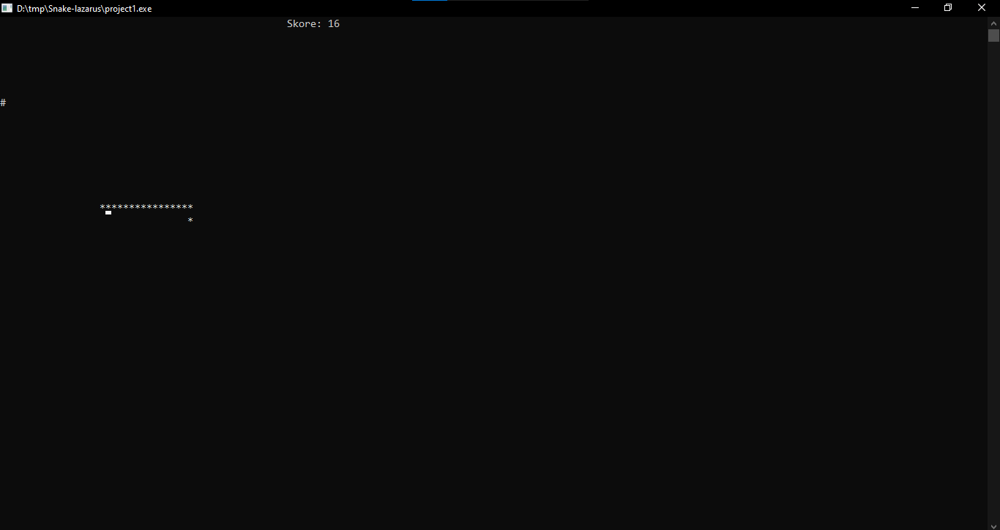

# Snake Game in Pascal

## Overview

This Pascal program implements a simple Snake game. The player controls a snake that moves around the screen, grows longer by eating food ('#'), and loses a life if it bites itself. The goal is to achieve the highest score by collecting as much food as possible.

## Features

-   **Snake Movement:** The snake moves in the direction specified by the player.
-   **Food Generation:** Food ('#') is randomly generated on the screen for the snake to eat.
-   **Score Tracking:** The player's score is displayed on the screen.
-   **Game Over:** The game ends when the snake bites itself, and the final score is shown.

## Controls

-   **w:** Move the snake up
-   **d:** Move the snake right
-   **s:** Move the snake down
-   **a:** Move the snake left

## Getting Started

1. Copy the program code into your Pascal environment.
2. Compile and run the program.

## Game Instructions

-   Control the snake using the specified keys.
-   Eat the food ('#') to increase your score.
-   Avoid biting yourself; doing so will cost you a life.
-   The game ends when all lives are exhausted.

## Screenshots

## License

This project is licensed under the MIT License - see the [LICENSE](LICENSE) file for details.
